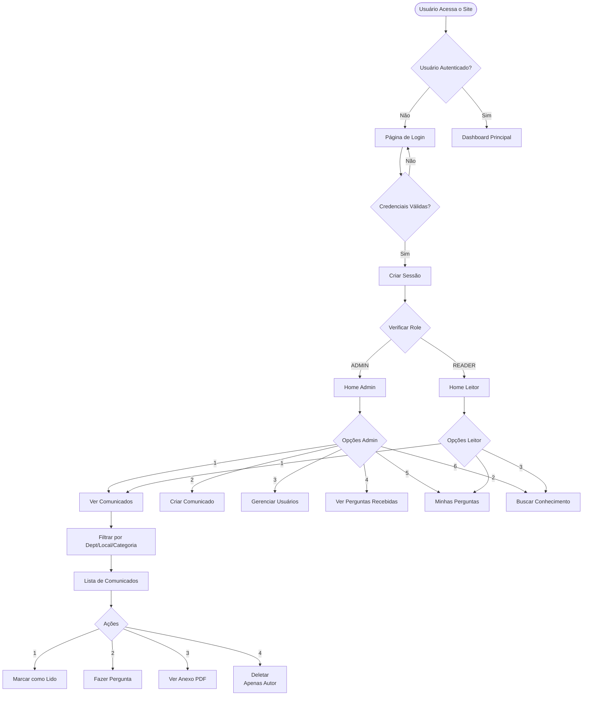
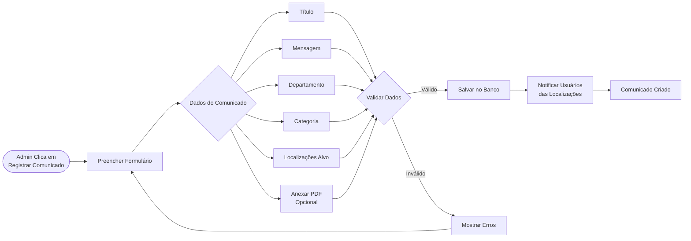
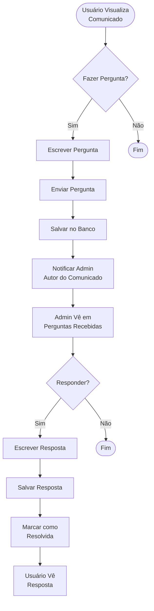
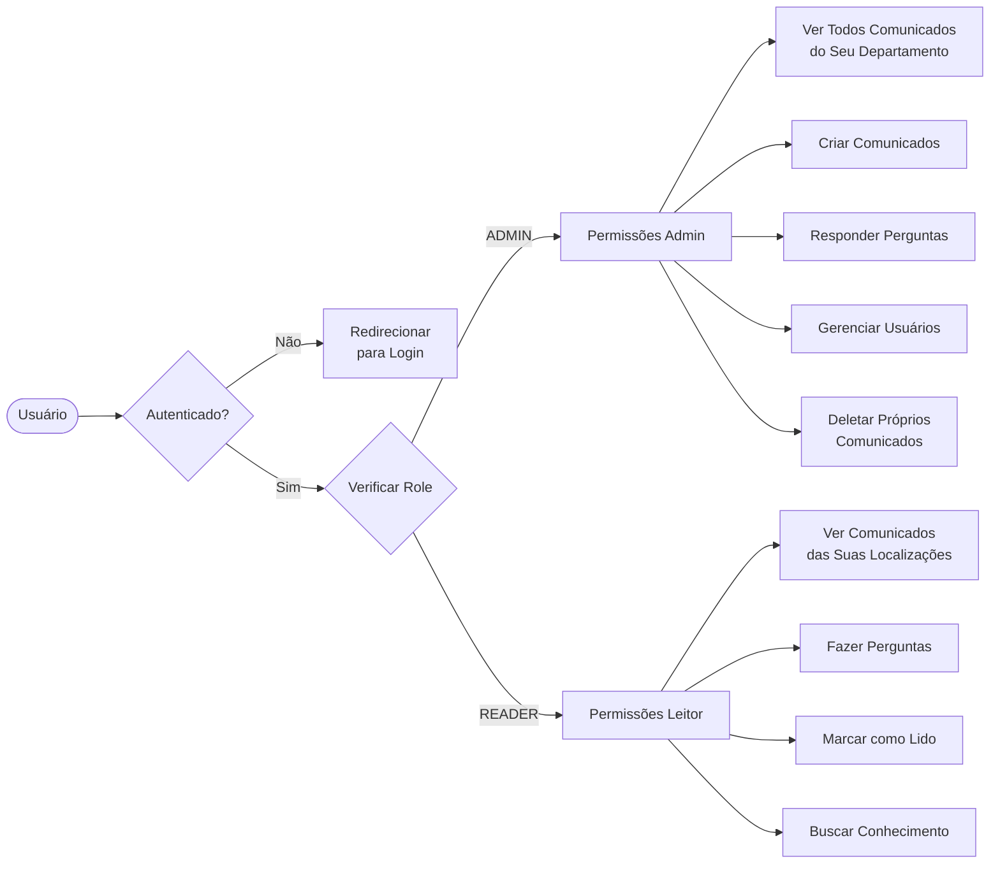
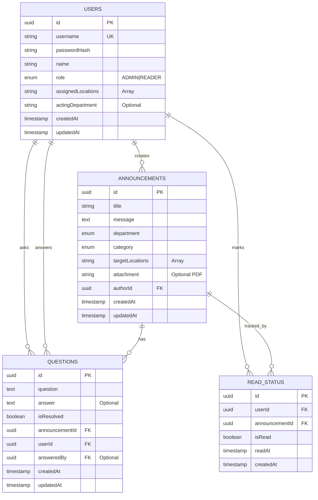
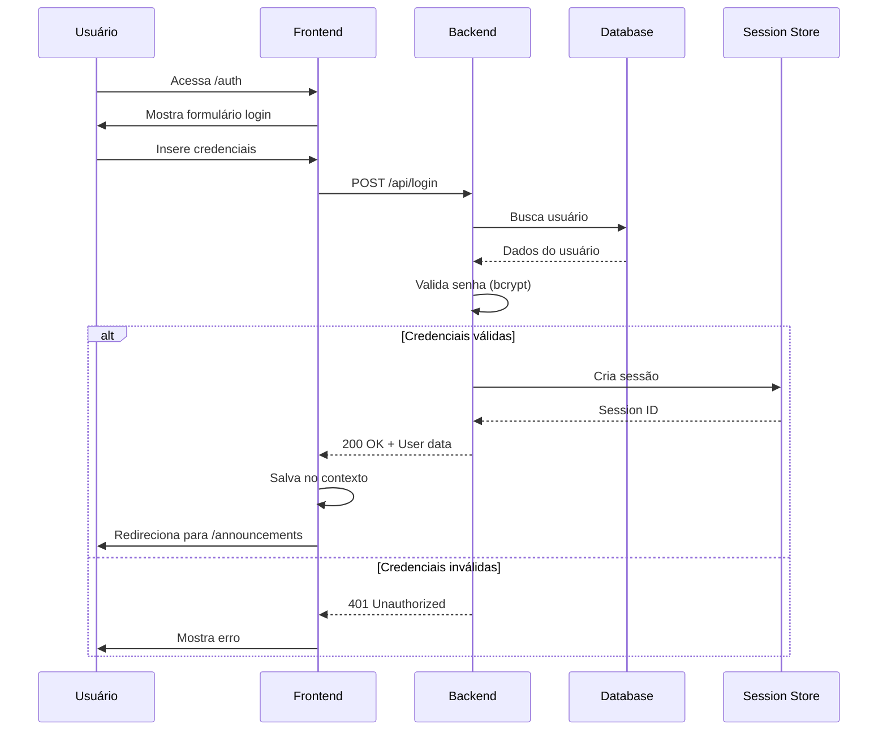
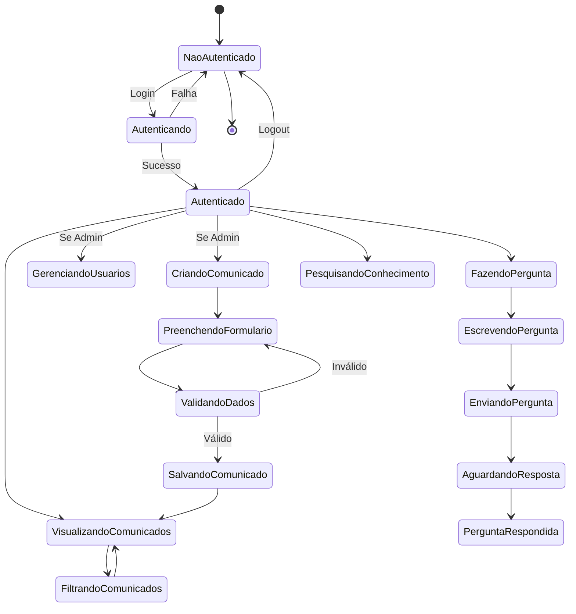

# Fluxograma do Sistema Auralis - Comunicados Corporativos

## 1. Fluxo Geral do Sistema

## 2. Fluxo de Criação de Comunicados (Admin)

## 3. Fluxo de Perguntas e Respostas

## 4. Fluxo de Permissões e Acesso

## 5. Estrutura de Dados

## 6. Fluxo de Autenticação Detalhado

## 7. Estados do Sistema

## Legenda

- **ADMIN**: Administrador do sistema
- **READER**: Leitor/usuário comum
- **Departamentos**: CONTROLES_INTERNOS, ADMINISTRATIVO, CICLO_DE_CREDITO
- **Categorias**: INFORMATIVO, ATUALIZACAO, DETERMINACAO
- **Localizações**: MARACAJU, SIDROLANDIA, AQUIDAUANA, NIOAQUE

---

Este fluxograma representa a estrutura completa do sistema Auralis, mostrando como os diferentes componentes interagem e como os usuários navegam através das funcionalidades disponíveis.